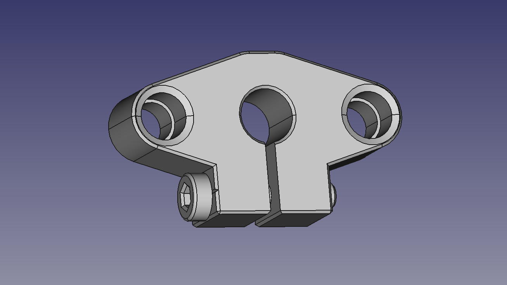

# Marlon Mark I - 3D Printer

[Main page]

## Mechanics

### Frame

Technical specifications:
- Frame type: T-Slot 2020-6
- Width: 337 mm
- Height: 445 mm
- Depth: 287 mm

#### Hinges

T-Slot 2020 Hinge

Technical specifications:
- Frame type: T-Slot 2020-6
- A:  mm
- B:  mm
- C:  mm
- D:  mm
- E:  mm

#### Round Roll T-Nut for T-slot 2020

##### M3
Technical specifications:
- Material: Nickel Plated
- Shaft: 3mm

##### M4
Technical specifications:
- Material: Nickel Plated
- Shaft: 4mm

##### M5
Technical specifications:
- Material: Nickel Plated
- Shaft: 5mm

### CoreXY

The [CoreXY] is a open source two-axis linear motion implementation developed at MIT Media Lab.

Overall, it delivers the same benefit of the H-bot, a light moving platform, by keeping both motors fixed to the frame. Furthermore, by crossing the belt, the unwanted torque vectors of H-bot model are eliminated.

#### SC8LUU

Technical specifications:

#### Linear rod
Technical specifications:
- Diameter: 8 mm
- Lenght: 300 mm
- Material: Carbon Steel

#### Pulley
Technical specifications:
- Timing: 20T
- Bore: 5mm
- Belt: GT2 6 mm

#### Belt
Technical specifications:
- Standard: GT2
- Pinch: 2 mm
- Wide: 6 mm
- Lenght: ??? mm

### Elevator (z axis)

#### Base
Technical specifications:
- Material: Celeron

#### LMH8UU

#### SHF

Technical specifications:

#### Shaft coupler
Technical specifications:
- Diameter: 19 mm
- Lenght: 25 mm
- Material: Aluminium
- Net weight: 16 g
- Shaft: 5 -> 8 mm

#### Threaded rod
Technical specifications:
- Material: 304 Stainless Steel
- Diameter: 8 mm
- Pitch: 2 mm
- Lead: 4
- Length: 400 mm

#### T8
Technical specifications:
- Material: Brass
- Big nut diameter: 30mm
- Thickness: 5mm
- Small nut diameter: 16mm
- Feature: anti-backlash

#### Linear rail
Technical specifications:
- Diameter: 8 mm
- Lenght: 400 mm
- Material: Carbon Steel

[Main page]

---

[Celeron TechSpecs]: dados-tecnicos-celeron.pdf
[Main page]: ../README.md
[CoreXY]: http://corexy.com/
