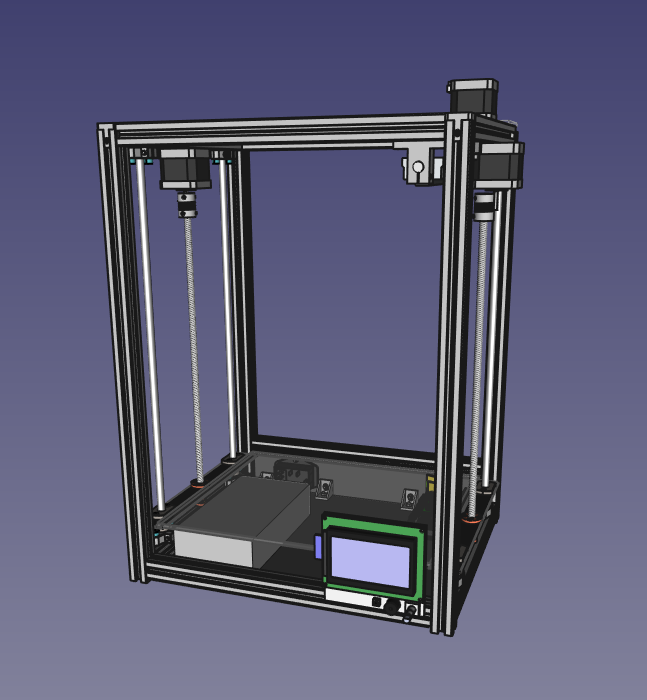

# Marlon Mark I - 3D Printer

## Introduction

Marlon is a Marlin firmware based 3D Printer. It uses RepRap concept with RAMPS.

<!---
Work area:

Width: ??? mm
Height: ??? mm
Depth: ??? mm
--->

## Changes
All notable changes to this project will be documented in this [Change log](CHANGELOG.md).

## Mechanics
This project uses an original mech made from scratch with the following goals:
- Reliable
- Precise
- Robust
- Well done
- Almost cheap, but very beautiful

Check out [Mechanics](Mechanics/README.md) design to know more.

## Electronics
Arduino, RAMPS and Full Graphic Smart Controller are used to [Electronics](Electronics/README.md) control system.

## Firmware
Marlin is my [Firmware](Firmware/README.md)! :-)

## Software
A lot of softwares can be used to draw 3D objects, slice, convert to G-code and print. Here are [some recommended softwares](Software/README.md).

## BOM - Bill of materials
If you want to build your own, take a look at [Bill of materials](BOM.md).

## Project Kanban
This project is always under enhancements. I use [Kanban](KANBAN.md) to control project evolution.

---
